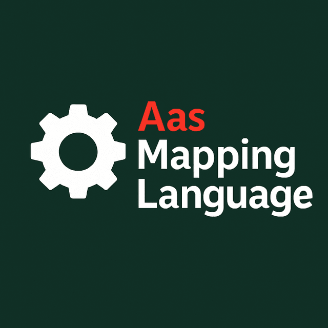

# AAS Mapping Language (AML)



A declarative mapping from JSON payloads to nested JSON or AAS v3 Submodel JSON (via AAS4J).

## What is AML?

AML lets you assemble valid IDTA-compliant Submodel instances from raw data without manually loading semantic models, dereferencing references, or hand-marking fields. Instead of starting from the semantic model, you describe how the Submodel should look based on the data you actually have.

With this approach you can:

- Define a reusable config for a Submodel template.
- Optionally export a JSON Schema for the expected input data.
- Map input data to your configuration.

The result is an AAS4J‑conformant Submodel instance containing all required values. Alternatively, you can use the same configuration language to produce a deeply nested JSON structure with powerful transformation, validation, and conditional mapping features

To further explore the usage read the docs section!

## Features
- Rule-based YAML/JSON configs
- JsonPath/constant/variable sources
- Transforms: trim, round, unitConvert, parseDateTime, toZoned, clamp, lookup, regexExtract, concat, defaultIfEmpty
- Constraints: range, regex, enum, maxLength
- AAS output: Submodel header + initialElements → AAS4J-serialized Submodel

## Requirements
- Java 21
- Maven 3.8+

## Dependencies
- AAS4J: `org.eclipse.digitaltwin.aas4j` 1.0.4 (`aas4j-model`, `aas4j-dataformat-json`, `aas4j-dataformat-core`)
- Jackson: `com.fasterxml.jackson.core:jackson-databind` 2.20.0, `com.fasterxml.jackson.dataformat:jackson-dataformat-yaml` 2.20.0
- JsonPath: `com.jayway.jsonpath:json-path` 2.9.0
- Logging: `org.slf4j:slf4j-simple` 2.0.13 (runtime)
- Tests: `junit:junit` 4.11, `org.junit.jupiter:junit-jupiter` 5.10.2 (test scope)

Notes:
- Managed by Maven via `pom.xml`; no manual installation required.
- Check licenses in each dependency if redistributing binaries; this project is Apache-2.0.

## Quick Start
Build and run a mapping:

```bash
mvn -q -DskipTests exec:java -Dexec.args="map --config <config.yaml> --payload <payload.json> --outdir out"
```

PowerShell quoting:

```powershell
mvn -q -DskipTests exec:java "-Dexec.args=map --config <config.yaml> --payload <payload.json> --outdir out"
```

Notes:
- Config must follow `schema/Aas_Mapping_Language_v1.json` (packaged in resources)
- If `--outdir` is omitted, the result prints to stdout
- Sample files live under `src/test/resources/examples/`

Export expected input JSON Schema from a config:

```bash
mvn -q -DskipTests exec:java -Dexec.args="schema --config <config.yaml> --out out/schema.json"
```

## Examples
- SerialPart (Catena‑X): `docs/example-serialpart.md`
- Batch 3.0.0 (Catena‑X): `docs/example-batch.md`
- Advanced features: `docs/example-advanced.md`

## CLI
Args:
- `--config`: Mapping config (`.yaml`/`.yml`/`.json`)
- `--payload`: Input payload JSON
- `--outdir`: Optional output directory; writes `<name>.json` using `config.name` or `submodel.idShort`
- `--export-schema`: Write a JSON Schema describing required input fields and constraints

More: `docs/cli.md`

## AML Language
- Top‑level: `apiVersion`, `name`, `model`, optional `submodel`, `variables`, `rules`
- Targets use `/` to build nested paths
- Sources: `{ jsonPath }`, `{ constant }`, `{ var }`
- Constraints run after transforms; define ranges in the final unit

Full guide: `docs/aml-config.md`

## Developing
- Tests: `mvn -q -DskipTests=false test`
- Key files:
  - `src/main/java/com/soffico/mapping/MappingEngine.java`
  - `src/main/java/com/soffico/mapping/aas/Aas4jSubmodelFactory.java`
  - `src/main/resources/schema/Aas_Mapping_Language_v1.json`

## License
Apache-2.0 — see `LICENSE`.
